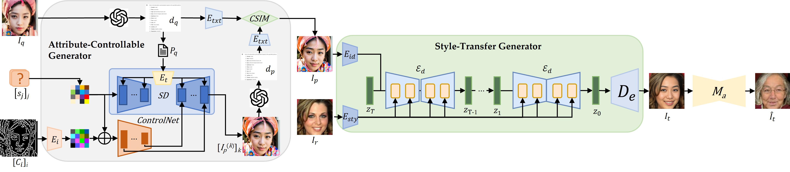
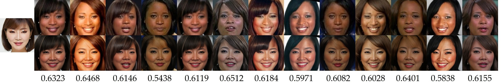
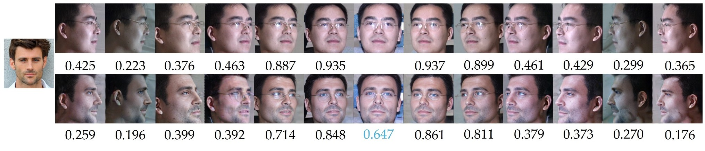
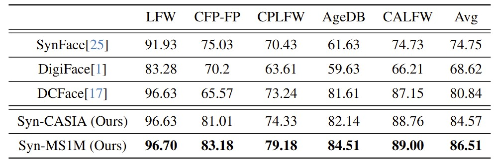

# Formulated Diffusion with Transferred Attributes for Face Synthesis and Recognition

> **Abstract:** We propose the Formulated Diffusion with Transferred Attributes (FDTA) framework to synthesize faces of user-specified attributes and apply the synthesized faces to train face recognition models. Our work addresses several important issues associated with models trained on real faces, including attribute imbalance, privacy concerns, and the complexities of data annotation. The proposed FDTA framework comprises two synergistic modules: the Attribute Controllable Generator (ACG) and the Style Transfer Generator (STG). The ACG aims to create unique face images with user-specified attributes including gender, race, age, facial shape, and others. It integrates ChatGPT in the design of formulated prompts that drive a Stable Diffusion model coupled with ControlNet to generate unique face images with desired attributes. The formulated prompts are designed based on learning from interactions with ChatGPT. Given an ACG-generated face and a reference face, the STG generates a target face of the same identity as the ACG-generated face but in the style of the reference face. Our approach enables users to specify attributes and diversify styles when making synthetic data for different applications. To evaluate the effectiveness of our approach, we generated four synthetic datasets, namely Syn-MPIE, Syn-MS1M, Syn-VGGFace2 and Syn-CASIA, and compared them with their real-life counterparts. We also benchmark our approach against other state-of-the-art methods that use synthetic data for face recognition.
>
> 
## Getting Started
- Clone the repo:
    ```
    git clone https://github.com/CVPR2025588/CVPR2025_FPST.git
    ```
## Installation
```python
conda create --name FDTA python=3.9
conda activate FDTA
pip install -r requirements.txt
```
## Syn-MS1M 
We used the unique ID $I_p$, generated by ACG, and paired it with $I_r$ from the real MS1M dataset as inputs for the STG. The STG was utilized to perform style transfer, generating $I_t$. Subsequently, $I_t$ was processed through $M_a$ to enhance age variations. This approach was used to create the Syn-MS1M-10K, Syn-MS1M-20K, Syn-MS1M-50K, and Syn-MS1M-100K datasets.



The image above shows examples of synthetic faces from the Syn-MS1M dataset. The leftmost face $I_p$ is the source, while the 13 faces to the right $I_t$ are the styled results. Below each $I_t$ is the CSIM score (computed using Arcface) comparing $I_p$ and $I_t$. The top row shows the reference styles $I_r$ used for the transfer.

### Syn-MS1M (10K ids/1M images)
Below is the Google Drive download link for Syn-MS1M, where each subject has undergone age and pose augmentation, including 10k subjects and 1M images.
- [Google Drive](https://drive.google.com/drive/folders/1TN_FftxXr_IP0iqsnu11itPGpCyfpYTo?usp=sharing)

## Syn-MPIE 
The original Multi-PIE database offers a diverse collection of facial data, featuring variations in pose, lighting, and expression. From this dataset, we selected 13 facial orientations (yaw angles ranging from -90° to +90° in 15° increments), seven lighting conditions, and two expressions (neutral and smiling). For each unique identity, 182 synthetic faces were generated. We conducted experiments with 200, 500, and 2000 unique identities, resulting in the creation of the Syn-MPIE-200, Syn-MPIE-500, and Syn-MPIE-2000 datasets, respectively.



The image above shows examples of synthetic faces in the MPIE dataset. The leftmost face $I_p$ is the source, the bottom row $I_t$ shows styled results, and the top row $I_r$ displays reference styles, each with a frontal image and pose variations. CSIM scores (computed using ArcFace) compare the frontal image with its pose variations in both $I_t$ and $I_r$. The light blue CSIM below $I_t$’s frontal image indicates its similarity to the source $I_p$.

### Syn-MPIE (2K ids/0.36M images)
Below is the Google Drive download link for Syn-MPIE, which includes 10k subjects and 0.36M images.
- [Google Drive](https://drive.google.com/drive/folders/1NQgHm_CM7zgnXtq_Vs5K6Y3s3zmEu8ZT?usp=sharing)

## Train.rec to JPG  
If you want to convert a train.rec file to JPG files, you can use rec2image.py to extract the images.

```
python rec2image.py --rec_path YOUR train.rec FILE PATH --output_dir YOUR DESIRED OUTPUT LOCATION
```

## Pretrained Models
| Architecture | Dataset      | Link
|--------------|--------------|-----------|
| LResNet50E-IR          | Syn-MS1M-10K | [Google Drive](https://drive.google.com/drive/folders/1TIBF4dSXZeTUSshphV7YiV7E-OkdMYYV?usp=sharing) |
| LResNet50E-IR          | Syn-MS1M-10K+ $M_a$ +STG | [Google Drive](https://drive.google.com/drive/folders/170Ympy3Ko_SaRtvhoB1kH4kMqOBFPja7?usp=sharing) |
| LResNet50E-IR          | Syn-MPIE-2000 | [Google Drive](https://drive.google.com/file/d/1MPU8gNiK9E1sBe_p6kLj4juPMR4o_nQF/view?usp=sharing) |

## Validation (LFW, CFPFP, CPLFW, CALFW, AGEDB)
Please download the validation set from [insightface](https://github.com/deepinsight/insightface/tree/master/recognition/_datasets_)
```python
python verification_torch.py
```

## Comparison with SOTA Models 

Verification accuracy on benchmarks of Our FR model with SOTA method. Our approach shows superior handling of cross-pose challenges, 
notably in the CFP-FP benchmark, while DCFace is particularly adept with the age variations in AgeDB. 
The data reflects Syn-MS1M’s consistently higher accuracy, underscoring the effectiveness of our approach in diverse face recognition scenarios.
